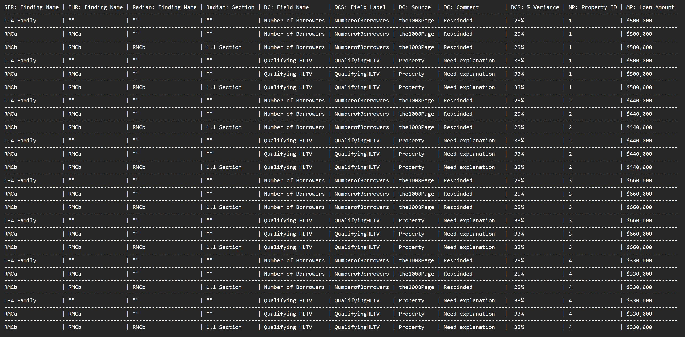

Compile and run the ProductionVersion main class to see the "working" example for the fourGroupTest() method.

DevVersion is the attempted rewrite I am working on. There's an infinite while loop stuck in there so it doesn't really run but you could debug it.

Good luck. This is likely the hardest problem I've ever attempted to solve via a computer

Basic Explanation of what im trying to do

FourGroupTest Expected output

